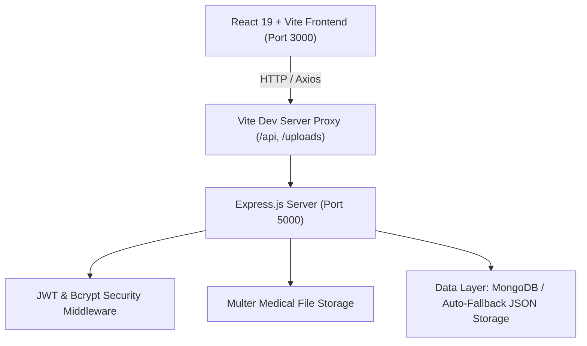

# 🏥 MediCare Plus — Modern Healthcare & Doctor Appointment Platform

<p align="center">
  
  
  
  
  
  
  
</p>

A full-stack, responsive healthcare appointment booking and doctor management portal engineered by **[Divya Patil](https://github.com/divyapatil1175)**. Built using the **MERN** stack architecture (MongoDB, Express.js, React, Node.js) with Vite, **MediCare Plus** provides role-based access for Patients, Doctors, and Administrators with appointment scheduling, medical document attachments, and real-time notification alerts.

---

## 🌟 Key Features

- 🔐 **Role-Based Authentication & Authorization**: Secure JWT-based access with Bcrypt password encryption supporting Patients, Doctors, and Admins.
- 🩺 **Doctor Discovery & Profile Browsing**: View approved medical specialists, their experience, consultation fees, contact details, and clinic timings.
- 📅 **Interactive Appointment Scheduling**: Book slots with preferred doctors, select dates and times, and track status (`pending`, `approved`, `rejected`).
- 📂 **Medical Document Attachments**: Upload prescriptions, past lab reports, and medical histories during booking using Multer file storage.
- 🔔 **In-App Notification Hub**: Instant unread notification bell with badge counters for booking updates, doctor application decisions, and schedule confirmations.
- 👨‍⚕️ **Doctor Application Workflow**: Qualified physicians can submit credentials and clinic details for administrative vetting.
- 🛡️ **Administrative Control Panel**: Comprehensive dashboard to approve or reject doctor applications and monitor platform users.
- 💾 **Dual Storage Engine**: Full support for MongoDB with an automatic zero-config local JSON persistence fallback for instant plug-and-play development.

---

## 🏗️ System Architecture



---

## 📂 Project Structure

```text
medicare-plus/
├── client/                     # Frontend Application (React + Vite)
│   ├── public/                 # Static public assets
│   ├── src/
│   │   ├── assets/             # Brand logos & icons
│   │   ├── components/         # Reusable UI (Layout, BookingModal, ProtectedRoute)
│   │   ├── context/            # Global Auth Context & State
│   │   ├── pages/              # Views (Home, Login, Register, Admin, Doctor Profile)
│   │   ├── services/           # Axios API Client configuration
│   │   ├── App.jsx             # Client routing & toast notifications
│   │   ├── index.css           # Modern medical design system & styling
│   │   └── main.jsx            # Application entry point
│   ├── index.html              # HTML template with Google Fonts & metadata
│   ├── package.json            # Frontend dependencies
│   └── vite.config.js          # Vite config & proxy rules
│
├── server/                     # Backend Application (Node.js + Express)
│   ├── config/                 # Database connection & dual-storage engine
│   ├── controllers/            # Business logic (Auth, User, Doctor, Admin)
│   ├── middlewares/            # JWT verification & Multer file uploads
│   ├── models/                 # Mongoose schemas & storage wrappers
│   ├── routes/                 # Express API routes
│   ├── uploads/                # Stored medical documents & prescriptions
│   ├── .env                    # Environment variables
│   ├── package.json            # Backend dependencies
│   └── server.js               # Express application entry & auto-seeder
│
├── package.json                # Monorepo root scripts
└── README.md                   # Project documentation
```

---

## 🚀 Getting Started

### 1. Prerequisites
- **Node.js** (v18 or higher recommended)
- **npm** (v9 or higher)
- *(Optional)* **MongoDB** running locally or via MongoDB Atlas (a built-in file-storage fallback is active if MongoDB is not present).

---

### 2. Installation

Clone your repository:
```bash
git clone https://github.com/divyapatil1175/Bookadoctor.git
cd Bookadoctor
```

Install dependencies for both backend and frontend:
```bash
# Install server dependencies
cd server
npm install

# Install client dependencies
cd ../client
npm install

# Return to root
cd ..
```

---

### 3. Environment Configuration

The server configuration resides in [`server/.env`](file:///c:/Users/DELL/Desktop/Projects/nasscom/bookadoctor-1/server/.env):
```env
PORT=5000
MONGO_URI=mongodb://127.0.0.1:27017/book_a_doctor
JWT_SECRET=medicare_secret_jwt_key_2026_super_secure
NODE_ENV=development
```

---

### 4. Running the Application

You can launch both services simultaneously:

#### Terminal 1 — Start Backend Server:
```bash
cd server
npm start
# Server listens on http://localhost:5000
```

#### Terminal 2 — Start Frontend Client:
```bash
cd client
npm run dev
# Vite runs on http://localhost:3000
```

Visit **[http://localhost:3000](http://localhost:3000)** in your browser.

---

## 🔑 Default Accounts & Credentials

The system seeds sample accounts automatically upon first startup:

| Role | Email | Password | Description |
| :--- | :--- | :--- | :--- |
| **Admin** | `admin@medicare.com` | `Admin@123` | Doctor approval & platform management |
| **Doctor (ENT)** | `k@gmail.com` | `Doctor@123` | Dr. Koushick (Approved) |
| **Doctor (Blood)** | `user@gamil.com` | `Doctor@123` | Dr. SHIVA (Approved) |
| **Doctor (Cardiology)** | `ka@gmail.com` | `Doctor@123` | Dr. Karthick (Pending approval) |

*To register as a standard patient/user, use the **Register** link on the login page.*

---

## 📡 API Reference Overview

### Authentication (`/api/auth`)
- `POST /api/auth/register` — Register a new patient or administrator
- `POST /api/auth/login` — Sign in and receive JWT token

### User & Patient (`/api/user`)
- `GET /api/user/getAllDoctors` — Fetch approved doctors directory
- `POST /api/user/book-appointment` — Schedule appointment with prescription upload
- `GET /api/user/user-appointments` — View user's booked appointments
- `POST /api/user/apply-doctor` — Submit doctor credential application
- `POST /api/user/get-all-notification` — Mark all notifications as read
- `POST /api/user/delete-all-notification` — Clear read notifications

### Doctor Portal (`/api/doctor`)
- `POST /api/doctor/getDoctorInfo` — Fetch doctor profile data
- `POST /api/doctor/updateProfile` — Update doctor consultation details
- `GET /api/doctor/doctor-appointments` — List appointments assigned to doctor
- `POST /api/doctor/change-appointment-status` — Approve or reject patient appointments

### Admin Management (`/api/admin`)
- `GET /api/admin/getAllDoctors` — View all doctor applications
- `GET /api/admin/getAllUsers` — View all registered accounts
- `POST /api/admin/changeAccountStatus` — Approve or reject doctor status

---

## 👩‍💻 Author & Maintainer

**Divya Patil**
- **GitHub:** [@divyapatil1175](https://github.com/divyapatil1175)
- **Project:** MediCare Plus

---

## 📄 License

This project is licensed under the [MIT License](LICENSE).
